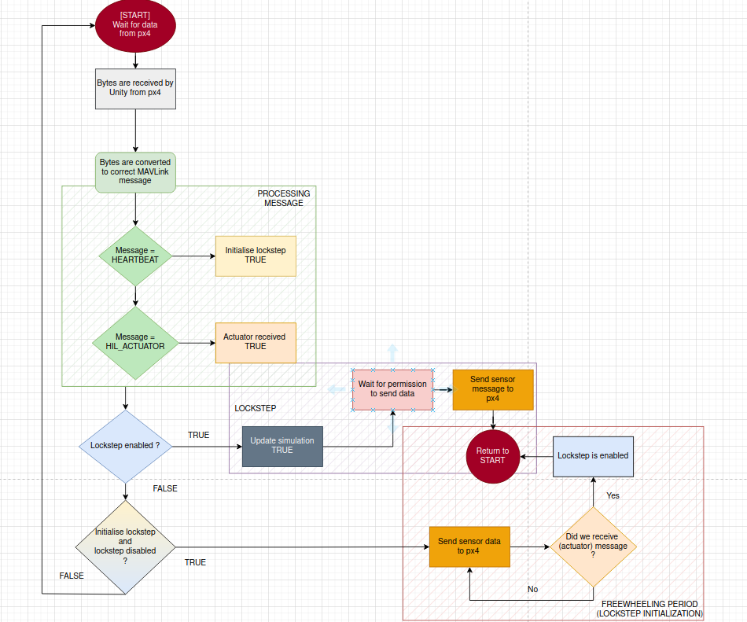

# About the Communication between Unity and px4

The communication between Unity and px4 works in
[Lockstep](https://docs.px4.io/main/en/simulation/#lockstep-simulation).  
 
Messages are send and received by using the [MAVLink protocol](https:///mavlink.io/en/).  

Inside Unity, the PX4Connector object in the Unity Hierarchy contains 
`Connection.cs` script,   
this script handles the communciation on a background thread.  
The communication code of px4 is inside DUS px4 repsitory `simulator_mavlink.cpp`.  

## MAVLink message
The MAVLink C# Library is generated by using `python3 mavgenerator.py`   
inside the DUS px4 repository(`/src/modules/mavlink/mavlink_source`).

This library gives Unity access to classes, struct etc. for creating and reading MAVLink messages.

### Future work
detect when mavlink messages are out of sync. This is important, because the mavlink messages are updated constatantly by the DUS software team.

### MAVLink messages: To px4
- The IMU sensor: [HIL_SENSOR](https://mavlink.io/en/messages/common.html#HIL_SENSOR)
- The GPS sensor: [HIL_GPS](https://mavlink.io/en/messages/common.html#HIL_GPS) 

### MAVLink messages: To UnitySim
- Actuator controls: [HIL_ACTUATOR_CONTROLS](https://mavlink.io/en/messages/common.html#HIL_ACTUATOR_CONTROLS)

## Communication flow
The communication flow is as followed:

1. Unity starts connection to px4
2. Unity receives Heartbeat messages
3. Unity starts freewheeling period
4. Unity receives a message
5. Unity starts lockstep communication

### Communication flow: Freewheeling period
Unity keeps sending sensor data until it receives actuator data, know lockstep is ready!

### Communication flow: Lockstep
Unity sends sensor data to px4 --> Px4 receives data and does calculations --> px4 sends actuator controls to Unity --> Unity receives actuator message --> Unity takes a simulation step [REPEAT]

  
Controlflow of Connection.cs, CommunicationHandler function, which manages sending and receiving of messages.

  
Controlflow of how the simulation loop works, which is inside Movement.cs, FixedUpdate function.  

## Unity FixedUpdate() call frequentie for lockstep simulation
[Info](http://blog.lidia-martinez.com/fixedupdate-fixedtimestep-maximum-allowed-timestep-unity)  
- Fixed Timestep = 0.004s = 250hz

## Multiple messages comming in hot
When Unity connects to px4, Unity receives two messages, a heartbeat message and a command long message.  
The arrival of these messages happens quite fast, inside the CommunicationHandler function(in 
Connection.cs).  
This results in bothe messages ending up in the same stream buffer.  

The c# The MAVLink generated library can only read one message from the stream buffer and throws away  
the other messages if there are any.    

For this reason the buffer needs to be parsed before given to the read function, that way each message  
can be read.  

The function ReadMessages(in Connection.cs) manages this  
by making use of the length of the buffer and the length of the messages it reads.  

