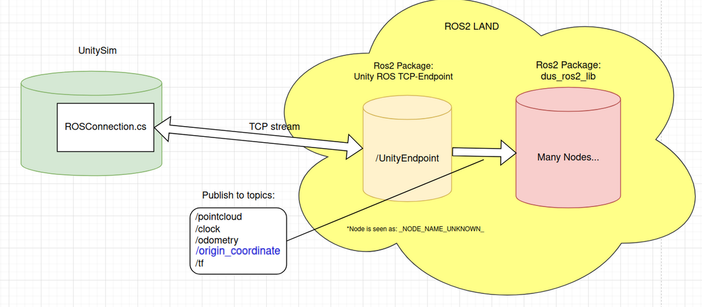

# How [ROS2](https://docs.ros.org/en/humble/index.html) works in Unity
Unity must establish communication with the Companion Computer (HLC) software, a crucial component encompassing the ROS2 package known as dus_ros2_lib. This specialized package initiates ROS2 and activates the obstacle avoidance functionality. Unity conveniently interfaces with this system through its official ROS2 package, facilitating seamless communication between Unity and its proprietary packages within the ROS2 environment.

## How it is installed inside Unity
For the installion, the following installation guide has been followed:
https://github.com/Unity-Technologies/ROS-TCP-Connector.

## How it works
Within the Unity Editor Hierarchy, the ROS2Connector object is equipped with the
ROSConnection.cs script component.  This script, sourced from the Unity 
package, is tasked with orchestrating and managing communication with Unity's ROS 
TCP-Endpoint package. 

The [ROS TCP Endpoint](https://github.com/Unity-Technologies/ROS-TCP-Endpoint), an official Unity ROS package, serves as a pivotal 
component in establishing an endpoint for receiving ROS messages originating from 
a Unity scene.  This ROS package collaborates seamlessly with the ROS TCP 
Connector Unity package. 

Upon initiating the simulation by executing ./px4_unity.sh within a DUS px4 
repository, the ROS TCP Endpoint package is activated.  Simultaneously, within 
Unity, the ROSConnection script takes charge of establishing a connection to this 
endpoint.

  
How Unity is connected to ros and communicate to companion ros node.   

## What data is being sent to the Companion ros2 topics
- Keep in mind at the time of writing, the companion ros2 version is humble

The following ros2 messages are benign sent to the following ros2 [topics](https://docs.ros.org/en/humble/Tutorials/Beginner-CLI-Tools/Understanding-ROS2-Topics/Understanding-ROS2-Topics.html) of the companion ros2 node, to make the obstacle avoidance feature work in DUMS:

- /clock (clockMsg) - Simply keeps track of the time.
    - This messages is made inside ROSClockPublisher.cs(Unity Hierarchy location VESSEL>ROS2Publisher)
    - Note: It comes from a unity ros2 tutorial package Nav2Slam. I slightly modified the Clock.cs file to make use of the simulation time.
- /pointcloud (Pointcloud2Msg) - Contains lidar sensor data.
    - This message is made inside Lidar.cs(Unity Hierarchy location VESSEL>lidar).
    - Note: DUS has there own point field structure, which has been used in Lidar.cs also, the hitpoint variable is transformed to Front Left UP(x,y,z).
-   /odometry (OdometryMsg) - The position, velocity, angular velocity and orientation of the vessel.
    -   This message is made inside ROSOdometryPublisher.cs(Unity Hierarchy location VESSEL>ROS2Publisher).
    - Note: The gps and imu data which is sent to px4 is used without added noise.
-   /tf (TransformStampedMsg)- Transform relations of the world to map to vessel to LiDAR coordinate frames
    - This message is made inside ROSTf2Publisher.cs(Unity Hierarchy location VESSEL>ROS2Publisher).
    - Note: var vesselFrame is set to use ENU(east, nort, up) coordinate system. 

These messages are standard ROS2 messages more information about them can be found on the 
world wide web.

-   /origin_coordinate (GeoPointMsg) - Contains the starting gps latitude and longitude coordinates of the vessel.
    - Note: This is a custom DUS ros2 messages, see the following paragraph.
    - (Unity Hierarchy location VESSEL>ROS2Publisher)

## Custom DUS ROS2 message: GeoPointMsg (/origin_coordinate)

The message "GeoPointMsg" for the origin_coordinate topic, is not readily accessible through the standard ROS2 Unity 
package due to its custom nature as a DUS companion topic/message. Nonetheless, the ROS2 Unity 
package includes a convenient [tool](https://github.com/Unity-Technologies/ROS-TCP-Connector/blob/main/MessageGeneration.md) for generating ROS2 messages.  

It has been used to generate GeoPointMsg.cs inside RosMessages/DusRos2/msg.  

In cases where the need arises to introduce new custom DUS messages, the tool can be 
employed by providing the location of the corresponding ros2 .msg file within the 
dus_ros2_msgs installation directory on the companion installation.  
This enables the abilty to use the fields of the messages inside unity code base(dont forget to include it). 
